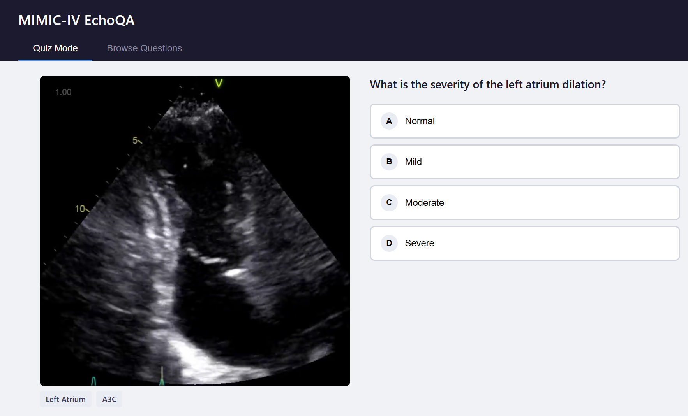
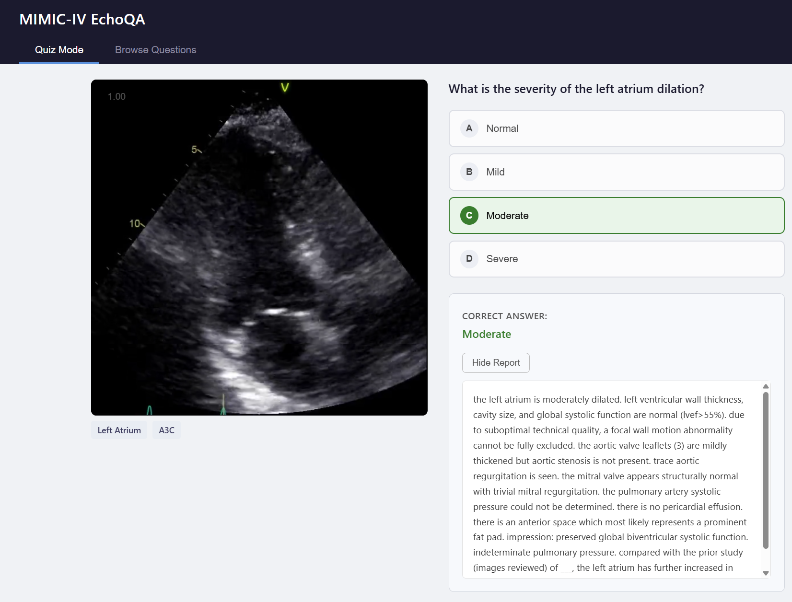
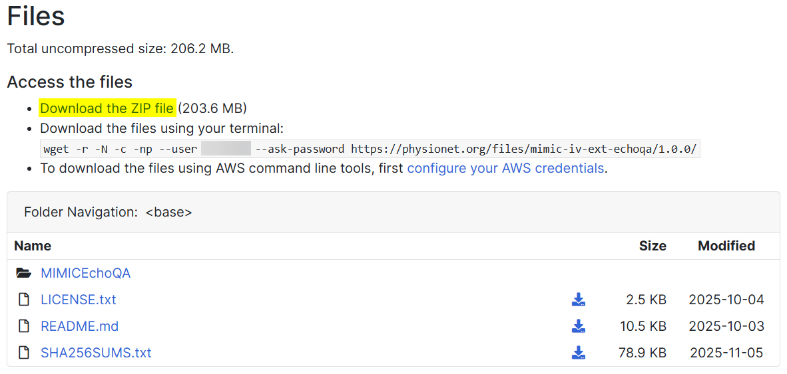

# MIMIC-IV Echo Quiz Application

Welcome! This is a simple, local web application for viewing and quizzing yourself on the **MIMIC-IV EchoQA dataset**. It's designed for medical residents, fellows, and trainees who want to familiarize themselves with echocardiogram videos and their corresponding clinical findings.

You can watch echo videos, test your knowledge by answering clinical questions, and review the correct answers alongside the original diagnostic reports.





## Quickstart Guide
Note: You must have Python installed on your computer to go any further. If you don't have that yet, please see below.

1.  **Download the Data**: Obtain the MIMIC-IV-Echo dataset ZIP file from [PhysioNet](https://physionet.org/content/mimic-iv-ext-echoqa/1.0.0/) (requires credentialed access).
2.  **Place ZIP in Root**: Place the file `mimic-iv-echo-ext-mimicechoqa-a-benchmark-dataset-for-echocardiogram-based-visual-question-answering-1.0.0.zip` in the root of this repository.
3.  **Run the Setup**: Navigate to the folder/repository, find the `Setup.ps1` PowerShell Script, Right Click it, and Open or Run with PowerShell. This will take care of extracting the Zip file, the videos, the necessary data, etc.
4.  **Start it up**: Once setup is complete, you can run the `Start.ps1` startup script in the same way.

---

## Step-by-Step Installation and Setup

This guide is for users with minimal or no programming experience.

### Step 1: Install Python

This application requires Python to run the local web server.

1.  **Download Python**: Go to the official Python website: [python.org/downloads](https://www.python.org/downloads/)
2.  **Run the Installer**: Open the downloaded installer.
3.  **IMPORTANT**: On the first screen of the installer, make sure to check the box that says **"Add Python to PATH"** at the bottom.
4.  Click **"Install Now"** and follow the on-screen instructions.

### Step 2: Get Access to the Medical Data

The echocardiogram data is confidential and requires free, credentialed access from PhysioNet.

1.  **Register on PhysioNet**: Create an account at [physionet.org/register](https://physionet.org/register/).
2.  **Become a Credentialed User**: Complete the required training (e.g., CITI "Data or Specimens Only Research") and apply for credentialing. See [PhysioNet Credentialing](https://physionet.org/about/credentialing/) for details. This process may take a few days.

### Step 3: Download and Setup the Data

1.  **Download the ZIP**: Once credentialed, go to the [MIMIC-IV-Echo dataset page](https://physionet.org/content/mimic-iv-echo-ext-mimicechoqa/1.0.0/) and download the complete dataset ZIP file:
    `mimic-iv-echo-ext-mimicechoqa-a-benchmark-dataset-for-echocardiogram-based-visual-question-answering-1.0.0.zip`



2.  **Place the File**: Move the downloaded `.zip` file into the main `MIMIC-IV-Echo-QuizApp` folder.
3.  **Run the Setup Script**:
    *   Right-click the `Setup.ps1` file and select **"Run with PowerShell"**, OR
    *   Open PowerShell, navigate to this folder, and type `.\Setup.ps1`.

The script will handle extracting the files, organizing them into the `data/` folder, and updating the database.

### Step 4: Run the Application

*   To start the application, simply run the start script in PowerShell:
    *   Right-click the `Start.ps1` file and select **"Run with PowerShell"**, OR
    *   Open PowerShell, navigate to this folder, and type `.\Start.ps1`.
    ```powershell
    .\Start.ps1
    ```
*   This will open your web browser and start the local server. Keep the PowerShell window open while using the app.

---

## For Developers

This is a simple vanilla JS/HTML/CSS application.

*   **`public/`**: Contains the frontend application (`index.html`, `app.js`, `styles.css`).
*   **`scripts/prepare_data.py`**: A Python script to process the raw data from PhysioNet. It cleans the JSON and restructures video paths, placing the final, app-ready files into `public/data`.
*   **`start.bat`**: A simple launcher for Windows users that provides a menu to either run the preparation script or start the server.
*   **Web Server**: The `start.bat` script uses `python -m http.server 8000` from within the `public` directory. A server is required because browser security policies (CORS) prevent `fetch()` from loading local files directly (`file://`).

## License
See the `LICENSE` file for more info.

The underlying MIMIC-IV-ECHO dataset is distributed under a separate, more restrictive license by PhysioNet. Please consult their website for data usage and citation requirements.
